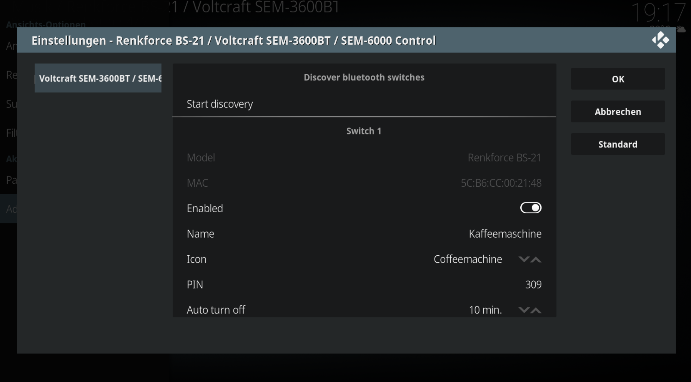

# kodi-addon-bluetooth-switches
Kodi addon in order to control Voltcraft's SEM bluetooth switches SEM-3600BT and SEM-6000 and Renkforce bluetooth switch BS-21




## Preparation

Before you can use this addon please check the preconditions of my projects that are used, i.e.

1. CLI tool [voltcraft-sem-6000](https://github.com/Heckie75/voltcraft-sem-6000)
1. CLI tool [voltcraft-sem-3600bt](https://github.com/Heckie75/voltcraft-sem-3600bt)
1. CLI tool [renkforce-bs21-bluetooth-switch](https://github.com/Heckie75/renkforce-bs21-bluetooth-switch)

Especially it is required that the devices you want to use are listed in ```bluetoothctl```

Example:
```
$ bluetoothctl
Agent registered
[bluetooth]# devices
Device 5C:B6:CC:00:21:48 BS-21-001063-0-A
Device 20:CD:39:1F:EC:DE WiT Power Meter
Device 5C:B6:CC:00:1A:AE BS-21-004593-0-A
Device D0:39:72:BB:AE:EC WiT Power Meter
Device 5C:B6:CC:00:1F:5A BS-21-000453-0-A
...
[bluetooth]#
```

## Download

The zip archive:
* [plugin.audio.bluetooth-switches.zip](https://github.com/Heckie75/kodi-addon-bluetooth-switches/raw/master/plugin.audio.bluetooth-switches.zip)